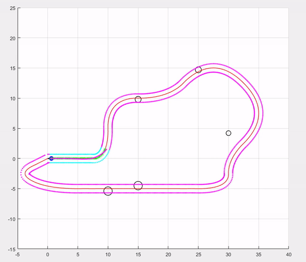

# Model-Predictive-Control
Model predictive control (MPC) of an autonomous vehilcle for lane tracking and obstacle avoidance with ACADO toolkit

Vehicle visualization code reference: https://github.com/adrianomcr/skid_steering_model
